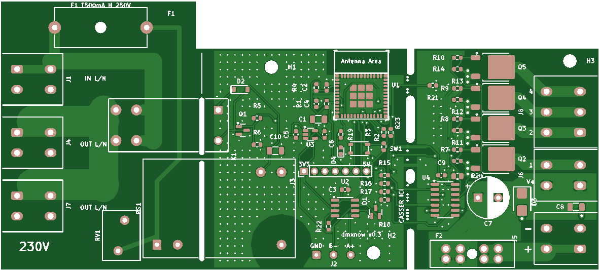
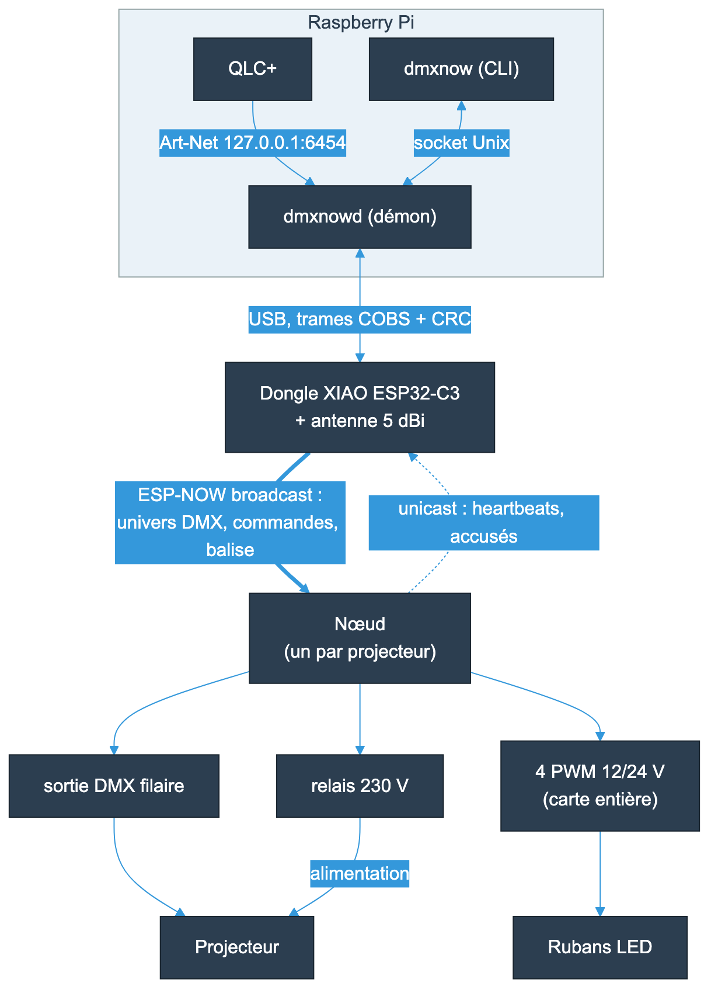

# dmxnow

Nœuds DMX et rubans LED sans fil, sur ESP-NOW, pilotés par QLC+ depuis un Raspberry Pi.

Chaque projecteur reçoit un petit boîtier monté sur son cordon secteur. Le boîtier
reçoit l'univers DMX par radio, le rend en DMX filaire, allume ou coupe l'alimentation
du projecteur par un relais et, sur la carte entière, pilote 4 canaux de rubans LED
12/24 V. Plus de câble DMX à tirer à travers la salle : seul le secteur arrive au
projecteur.

## Comment ça marche

- **QLC+** envoie de l'Art-Net en local au démon **`dmxnowd`**, sur le Raspberry Pi.
- Le démon passe les univers par USB à un **dongle** (XIAO ESP32-C3, antenne 5 dBi).
- Le dongle les diffuse en **ESP-NOW** : un paquet par univers, dès qu'une valeur change,
  et répété à 44 Hz. 4 univers par dongle conseillés, 8 au plus.
- Chaque **nœud** (ESP32-C3) garde son univers, sort la trame DMX, suit son canal de
  relais et ses canaux de rubans, et renvoie un heartbeat au Pi.
- Les commandes (`dmxnow relay`, `set`, `reboot`...) sont signées (HMAC-SHA256) et
  acquittées. Un nœud neuf s'enrôle en une commande.

Le détail illustré est dans [docs/fonctionnement.md](docs/fonctionnement.md).

## Deux variantes, une seule carte

| Variante | Usage | Boîtier |
|----------|-------|---------|
| Carte entière | projecteur + 4 canaux de rubans LED | 208 × 88 × 34 mm |
| Carte cassée | projecteur seul (partie rubans retirée) | 150 × 88 × 34 mm |

La partie rubans tient par trois onglets sécables qui portent ses pistes. Le nœud
détecte seul la variante.

## État du projet

| Livrable | État |
|----------|------|
| Spécification, protocole, décisions ([spec/](spec/)) | Validés (v1.0) |
| Carte v0.3 ([hardware/](hardware/)) | Commandée chez JLCPCB, 5 cartes montées, placement à valider |
| Firmware du nœud et du dongle ([firmware/](firmware/)) | Écrits, compilés et testés en CI |
| Démon et CLI du Pi ([pi/](pi/)) | Écrits, 50 tests (dongle simulé) |
| Boîtiers imprimés ([enclosure/](enclosure/)) | Nœud (2 variantes) et dongle, STL et STEP |
| Documentation ([docs/](docs/)) | Assemblage, flash, câblage, mise en service, sécurité |

Reste à mesurer sur banc à l'arrivée des cartes : portée et pertes radio, latence, charge
du dongle à 8 univers, timings DMX à l'analyseur logique, essais secteur du prototype.
La liste complète est dans [spec/SPEC.md](spec/SPEC.md) (points « À valider »).

## Par où commencer

| Je veux... | Lire |
|------------|------|
| Comprendre le système | [docs/fonctionnement.md](docs/fonctionnement.md) |
| Monter et installer des nœuds | [docs/README.md](docs/README.md), dans l'ordre : sécurité, assemblage, flash, câblage, mise en service |
| Installer le Pi | [pi/README.md](pi/README.md) |
| Refaire la carte | [hardware/README.md](hardware/README.md), commande JLCPCB : [hardware/ORDER.md](hardware/ORDER.md) |
| Imprimer les boîtiers | [enclosure/README.md](enclosure/README.md) |
| Modifier le firmware | [firmware/README.md](firmware/README.md) |

## Organisation du repo

| Dossier | Contenu |
|---------|---------|
| `spec/` | [SPEC.md](spec/SPEC.md), [PROTOCOL.md](spec/PROTOCOL.md), décisions d'architecture ([spec/adr/](spec/adr/)) |
| `hardware/` | Carte KiCad générée par script, gerbers, BOM et placement JLCPCB |
| `firmware/` | `common/` (protocole, testé sur PC), `node/` (nœud), `dongle/` (dongle USB) |
| `pi/` | Démon `dmxnowd`, CLI `dmxnow`, service systemd, règle udev, `install.sh` |
| `enclosure/` | Boîtiers CadQuery paramétriques, STL et STEP |
| `docs/` | Documentation d'utilisation, figures et diagrammes |

## Sécurité

🔴 Le nœud est raccordé au **230 V**. Lire [docs/securite.md](docs/securite.md) avant toute
manipulation. Toute la partie secteur (carte, boîtier, câblage) doit être relue par une
personne qualifiée avant fabrication et mise sous tension. Ce projet est fourni sans
aucune garantie.

## Licence

Matériel (carte, boîtiers, documentation) sous **CERN-OHL-S-2.0**, logiciel (firmware,
démon, CLI) sous **GPL-3.0-or-later**, bibliothèques KiCad tierces sous CC-BY-SA-4.0.
Détail dans [LICENSE](LICENSE).
