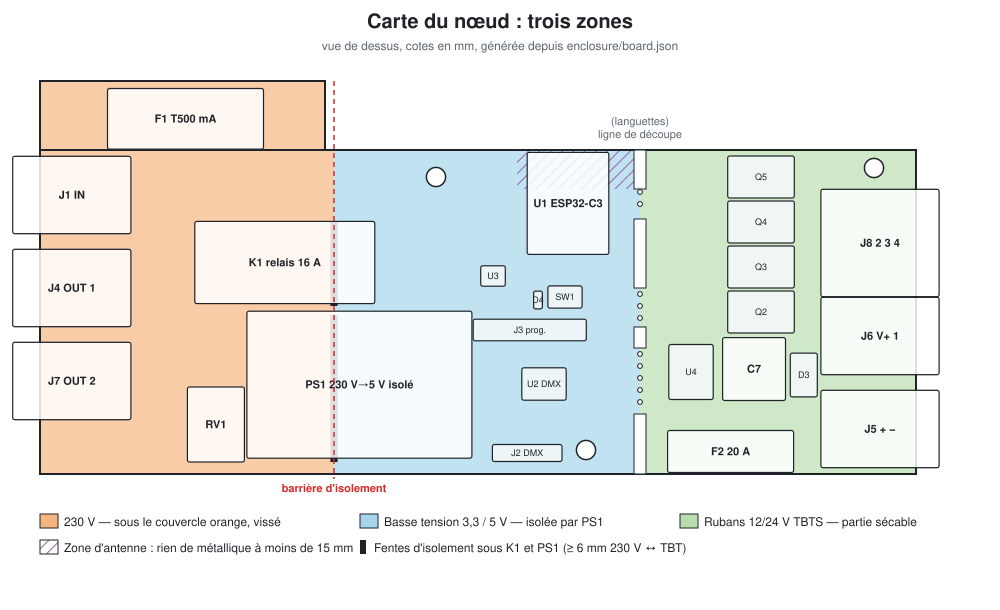

# Documentation dmxnow (livrable 8.7)

Un réseau DMX sans fil : QLC+ sur un Raspberry Pi envoie de l'Art-Net au démon `dmxnowd`,
qui le transmet par USB à un **dongle** ESP32-C3 ; le dongle diffuse les univers en
ESP-NOW à des **nœuds**. Chaque nœud rend une ligne DMX filaire vers un projecteur,
commute son alimentation 230 V par un relais et, sur la carte entière, pilote quatre
canaux de rubans LED 12/24 V.

```
QLC+ ─Art-Net─▶ dmxnowd (Pi) ─USB─▶ dongle ─ESP-NOW─▶ nœud ─┬─ DMX (XLR-3) ─▶ projecteur
                                                              ├─ relais 230 V ─▶ alimentation du projecteur
                                                              └─ 4 × PWM 12/24 V ─▶ rubans (carte entière)
```

🔴 **Le nœud est raccordé au secteur.** Lire [securite.md](securite.md) avant toute
manipulation ; ce document et la liste de contrôle qu'il contient demandent une
**relecture humaine obligatoire** par une personne qualifiée.



## Ordre de lecture

| # | Document | Pour qui, pour quoi |
|---|----------|---------------------|
| 0 | [fonctionnement.md](fonctionnement.md) | **Comprendre** : principes, radio, nœud, relais, rubans, commandes, maintenance, options — illustré |
| 1 | [securite.md](securite.md) 🔴 | Tout le monde : règles, essais du prototype, **liste de contrôle avant mise sous tension** |
| 2 | [assemblage.md](assemblage.md) | Réception des cartes, fusibles, découpe de la partie rubans, impression et montage du boîtier, dongle |
| 3 | [flash.md](flash.md) | Premier chargement du firmware (nœud par J3, dongle par USB-C), mises à jour OTA |
| 4 | [cablage.md](cablage.md) | Raccordement secteur, DMX, alimentation LED et rubans |
| 5 | [mise-en-service.md](mise-en-service.md) | Pi, QLC+, enrôlement des nœuds, maintenance, dépannage |

Le flash se fait **avant** le câblage secteur : un nœud se programme hors secteur, par
ses pastilles J3 (règle 2 de securite.md).

## Références

| Sujet | Source |
|-------|--------|
| Exigences, arbitrages, points à valider | [spec/SPEC.md](../spec/SPEC.md), [spec/adr/](../spec/adr/) |
| Protocole radio et série | [spec/PROTOCOL.md](../spec/PROTOCOL.md) |
| Carte, commande JLCPCB, relecture 230 V | [hardware/README.md](../hardware/README.md), [ORDER.md](../hardware/ORDER.md), [REVIEW.md](../hardware/REVIEW.md) 🔴 |
| Boîtiers (nœud, dongle) | [enclosure/README.md](../enclosure/README.md) |
| Firmware, recette sur banc | [firmware/README.md](../firmware/README.md) |
| Démon et CLI | [pi/README.md](../pi/README.md) |

## Vocabulaire

| Terme | Sens |
|-------|------|
| Carte entière / partie principale | La carte livrée (146 mm) porte la partie « projecteur » et la partie sécable « rubans » ; cassée, il reste la partie principale (100 mm) |
| Univers | Univers Art-Net (Port-Address 0 à 32767), 512 canaux DMX |
| `net_id` | Numéro de réseau choisi par `install.sh` ; un nœud neuf a `net_id` 0 |
| Enrôlement | Rattacher un nœud neuf au réseau (`dmxnow enroll`) |
| Maintenance | Point d'accès Wi-Fi `dmxnow-<nom>` + page web + OTA sur un nœud |
| TBTS | Très basse tension de sécurité (SELV) : < 60 V DC, isolée du secteur |
