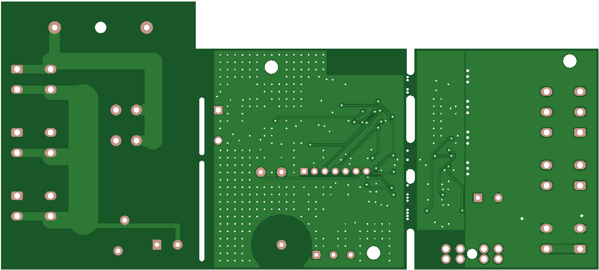

# Assemblage

🔴 Les étapes marquées 🔴 touchent à l'isolement secteur : **relecture humaine
obligatoire** ([securite.md](securite.md)).

## 1. Réception des cartes

Les cartes arrivent assemblées par JLCPCB ([hardware/ORDER.md](../hardware/ORDER.md)),
en une seule pièce (partie principale + partie rubans), **sans fusibles**.

Rendu JLCPCB des gerbers commandés (carte v0.3), pour repérer les composants :

Face bottom, vue par transparence (même sens que la face top) :

De gauche à droite :

- la partie secteur : J1, J4, J7, F1, RV1 ;
- K1 et PS1, à cheval sur les fentes d'isolement (les traits blancs verticaux) ;
- la partie commande : U1 et sa zone d'antenne, U2, U3, J2 (DMX), J3 (pastilles de
  flash), SW1 ;
- la partie rubans : U4, Q2 à Q5, J5, J6, J8, F2, C7, reliée au reste par trois
  onglets sécables.

### Retirer les rails de JLCPCB

Pour l'assemblage, JLCPCB ajoute un rail de 5 mm en haut et en bas de la carte (elle
passe à 146 × 75,5 mm). À leur demande (mail du 2026-09-29), le rail du haut tient aussi
la partie rubans par un petit pont à trous de rupture, près du coin haut droit, vers
X = 131 à 135 mm : sans lui, la partie rubans ne tenait que par les trois onglets et le
rail du bas, et risquait de casser en production. Aucune piste ne traverse ce pont.

1. Casser d'abord ce pont : tenir la partie rubans **tout près du pont**, entre le pont
   et le trou de fixation H3, et plier le rail vers la face arrière. Ne pas faire levier
   sur Q5, un MOSFET DPAK soudé à environ 1 cm du pont.
2. Casser ensuite les rails haut et bas sur toute leur longueur, de la même façon.
3. Ébavurer les bords à la lime douce.

**Ne pas toucher aux trois onglets** entre la partie principale et la partie rubans
(X = 100 mm) à cette étape : ils portent sept pistes. Les casser ou non se décide au §3.

Contrôle à réception, carte hors tension :

- [ ] aucun composant manquant ni de travers (K1, PS1, borniers WAGO, F1, F2, RV1, C7) ;
- [ ] fentes d'isolement fraisées sous K1 et PS1, dégagées (pas de résidu de flux ni de
      soudure) ; 🔴
- [ ] pastilles J2 et J3 non soudées, trous ouverts ;
- [ ] à l'ohmmètre : aucune continuité entre L, N (J1) et GND ; entre L et N (J1) :
      circuit ouvert ou haute impédance (entrée de PS1). 🔴

Les essais du prototype (diélectrique, charge, commutations) sont décrits dans
[securite.md §3](securite.md) et [hardware/REVIEW.md §6](../hardware/REVIEW.md) : ils
précèdent l'utilisation de toute la série.

## 2. Fusibles

| Repère | Fusible | Où l'acheter |
|--------|---------|--------------|
| F1 🔴 | Cartouche **T500 mA H 250 V céramique 5×20** (Littelfuse 0215.500MXP) | Hors JLCPCB ([ORDER.md](../hardware/ORDER.md)) |
| F2 | Fusible lame **ATO 20 A** (carte entière seulement) | Hors JLCPCB |

F1 se clipse dans son support. F2 s'enfonce dans son support (partie rubans) ; sur une
carte cassée, F2 n'existe plus.

## 3. Partie rubans : garder ou casser ?

| Besoin | Carte | Boîtier |
|--------|-------|---------|
| Projecteur + rubans | **Entière** (146 mm) | variante `full` |
| Projecteur seul | **Cassée** (100 mm) | variante `cut` |

Pour casser : **scier** les trois languettes perforées le long de la fente, au ras de la
partie principale, carte tenue dans un étau à mors doux ; ébavurer à la lime. Ne pas
casser à la main (efforts sur les pistes des languettes et sur les soudures voisines ;
[REVIEW.md §7.3](../hardware/REVIEW.md)). Le firmware détecte seul la variante au
démarrage (BOARD_SENSE, EF-07).

## 4. Impression du boîtier du nœud

Fichiers : `enclosure/out/full/*.stl` ou `enclosure/out/cut/*.stl`, déjà en position
d'impression. Détail, cotes et achats : [enclosure/README.md](../enclosure/README.md).

| Pièce | Qté |
|-------|-----|
| `base` | 1 |
| `cover_230v` (couvercle 230 V) | 1 |
| `lid_lv` (couvercle basse tension ; `lid_lv_light_pipe` si la LED D4 est montée) | 1 |
| `clamp_bar` (barre d'étrier) | 3 |
| `sw1_plunger` + `sw1_collar` | 1 + 1 |

- 🔴 Matériau **ABS-FR ou PC-ABS-FR UL94 V-0**. PLA, PETG et ABS standard sont interdits
  pour ce boîtier. Garder la fiche du filament.
- **100 % de remplissage**, imprimante fermée, buse 240 à 260 °C, plateau 100 °C,
  bordure (« brim ») sur la base. Aucun support.
- Contrôler chaque pièce : pas de délaminage, pas de fissure, cloison et languettes de la
  base entières. Une pièce douteuse se réimprime.

## 5. Montage de la carte dans le boîtier

Achats (presse-étoupes, inserts, vis, WAGO 221-413) : [enclosure/README.md §Achats](../enclosure/README.md).

1. **Inserts à chaud** M3 (Ø 4,0 × 5,7 mm) dans les bossages des couvercles, la sellette
   des étriers et les plots H2 (et H3 sur la carte entière). Insert droit, affleurant.
2. **WAGO 221-413** clipsé dans son logement, chambre de gauche (côté 230 V).
3. **Presse-étoupes** : M16 ×3 côté secteur, M16 ×2 côté rubans (carte entière), M12 pour
   le DMX. Contre-écrous à l'intérieur, **méplat contre méplat** (les trois écrous secteur
   sont serrés les uns contre les autres).
4. **Poussoir SW1** : glisser le poussoir dans son tube par-dessous le couvercle basse
   tension, emmancher (ou coller) le collier.
5. **Flasher le nœud maintenant**, carte encore hors boîtier : [flash.md](flash.md).
6. **Poser la carte** : l'ergot imprimé traverse H1 (pas de vis métallique près de
   l'antenne), les languettes de la cloison entrent dans les fentes d'isolement sous K1
   et PS1 🔴 ; la carte repose à plat sur ses plots. Visser H2 (et H3) : M3 × 6 +
   **rondelle isolante**.
7. Câbler : [cablage.md](cablage.md).
8. Visser le **couvercle basse tension** (M3 × 6), puis le **couvercle 230 V** par-dessus
   son bord (M3 × 6). 🔴 La jupe du couvercle 230 V doit descendre sans forcer entre K1/PS1
   et la cloison.

## 6. Dongle

Boîtier imprimable en PETG ou PLA (pas de secteur) : `enclosure/out/dongle/`. Achats et
montage : [enclosure/README.md §Boîtier du dongle](../enclosure/README.md).

1. Flasher le XIAO **avant** de fermer le boîtier ([flash.md §3](flash.md)) : les boutons
   BOOT et RESET ne sont plus accessibles ensuite (les mises à jour suivantes passent par
   l'USB-C sans bouton).
2. XIAO poussé contre la paroi USB-C ; embase RP-SMA passée de l'intérieur, rondelle et
   écrou à l'extérieur ; câble clipsé sur le connecteur U.FL, lové en boucle de 18 mm au
   moins ; couvercle clipsé ; antenne dipôle **RP-SMA** vissée à la main.
3. Ne jamais faire émettre le dongle sans antenne.
