# Fonctionnement, principes, options

Ce document explique **comment dmxnow marche** : qui parle à qui, ce que fait chaque
carte, et quelles fonctions et options existent. Les diagrammes sont des images PNG
rendues depuis leur source Mermaid, rangée à côté dans [`diagrams/`](diagrams/) (même
nom, extension `.mmd`). Les figures sont générées depuis les données du projet par
[`figures/make_figures.py`](figures/make_figures.py).

Détail normatif : [SPEC](../spec/SPEC.md) et [PROTOCOL](../spec/PROTOCOL.md). Mode
d'emploi : [mise-en-service.md](mise-en-service.md).

- [1. Vue d'ensemble](#1-vue-densemble)
- [2. Le chemin d'une valeur DMX](#2-le-chemin-dune-valeur-dmx)
- [3. La radio](#3-la-radio)
- [4. Le nœud](#4-le-nœud)
- [5. Le relais](#5-le-relais)
- [6. Les rubans LED](#6-les-rubans-led)
- [7. Commandes, enrôlement, sécurité](#7-commandes-enrôlement-sécurité)
- [8. Maintenance et mise à jour](#8-maintenance-et-mise-à-jour)
- [9. Le dongle et le Raspberry Pi](#9-le-dongle-et-le-raspberry-pi)
- [10. Options](#10-options)

---

## 1. Vue d'ensemble

| Élément | Rôle en une phrase |
|---------|--------------------|
| **QLC+** | Le pupitre logiciel : produit les univers DMX en Art-Net. |
| **dmxnowd** | Reçoit l'Art-Net, l'envoie au dongle, suit les nœuds, exécute et signe les commandes. |
| **dmxnow** (CLI) | Commandes d'exploitation : lister, enrôler, identifier, régler, forcer le relais, maintenance. |
| **Dongle** | Pont USB ↔ radio : diffuse les univers et les commandes, remonte heartbeats et accusés. |
| **Nœud** | Au pied de chaque projecteur : recrée une ligne DMX filaire, coupe ou rétablit le 230 V, pilote des rubans. |

**Principe clé** : un seul émetteur (le dongle), des récepteurs passifs. La radio
diffuse chaque univers en entier à tous les nœuds ; chaque nœud prend son univers et
ignore le reste. Ajouter un nœud ne coûte rien en radio.

## 2. Le chemin d'une valeur DMX

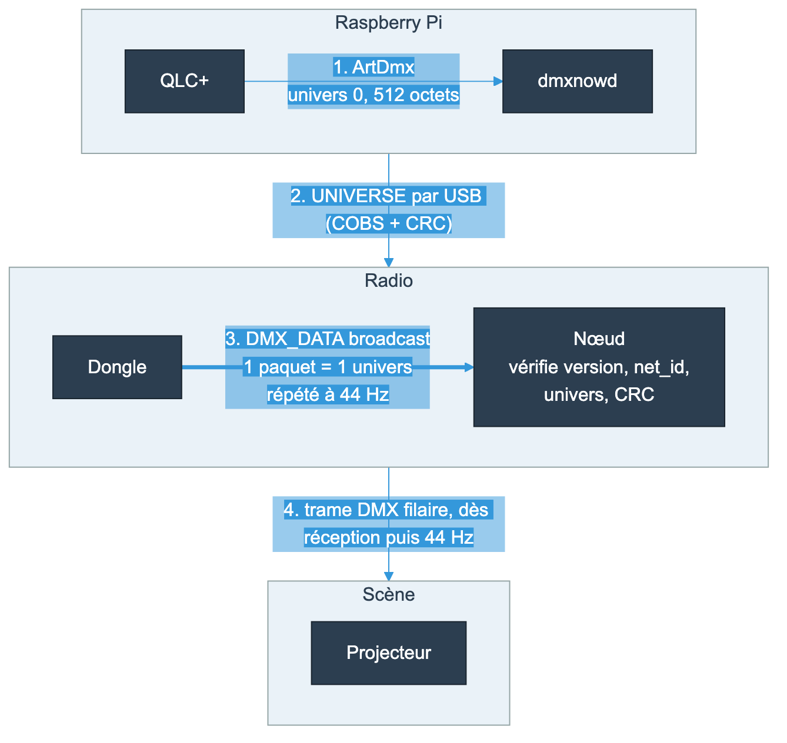

Chaque étape émet **sur événement** (dès qu'une valeur change, avec au moins 10 ms
d'écart) et **rafraîchit** à 44 Hz sans changement. Une trame radio perdue est corrigée
par la suivante, 23 ms plus tard au pire.

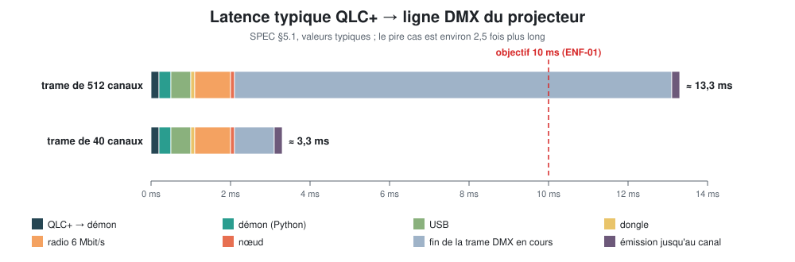

L'essentiel de la latence est l'attente de la fin de la trame DMX en cours sur le câble.
D'où l'option **trame courte** (`dmx_out_slots`) : le nœud n'émet que jusqu'au dernier
canal utile du projecteur.

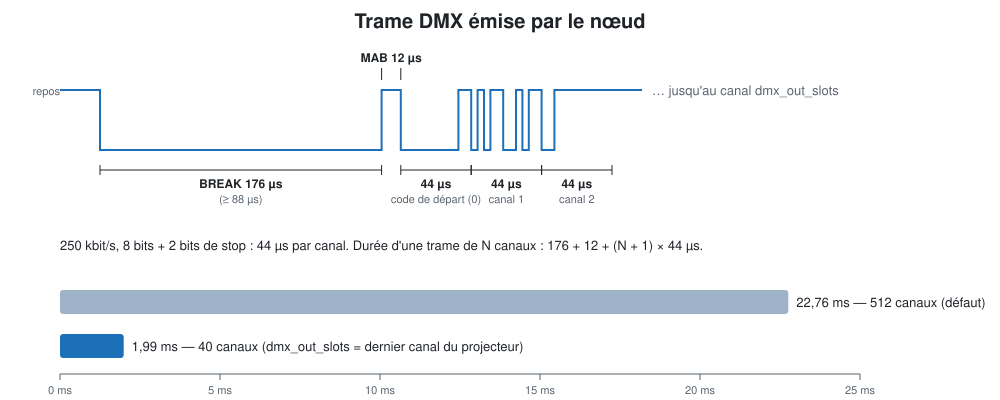

## 3. La radio

**ESP-NOW** : des trames Wi-Fi brutes entre puces Espressif, sans point d'accès ni
connexion. dmxnow utilise ESP-NOW **v2** (jusqu'à 1470 octets) : un univers complet (512
canaux + 18 octets d'en-tête) tient dans **un seul paquet**. Un univers n'est donc jamais
appliqué à moitié.

| Message | Sens | Adressage | Rythme | Contenu |
|---------|------|-----------|--------|---------|
| `DMX_DATA` | dongle → nœuds | broadcast | ≥ 44 Hz par univers | 512 canaux |
| `BEACON` | dongle → nœuds | broadcast | 1 Hz | « le réseau est là », même QLC+ arrêté |
| `COMMAND` | dongle → nœud(s) | broadcast, cible dans le paquet | à la demande, répété | identifier, régler, relais… |
| `ACK` | nœud → dongle | unicast | en réponse | résultat de la commande |
| `HEARTBEAT` | nœud → dongle | unicast | 2 s ± 250 ms | état complet du nœud |

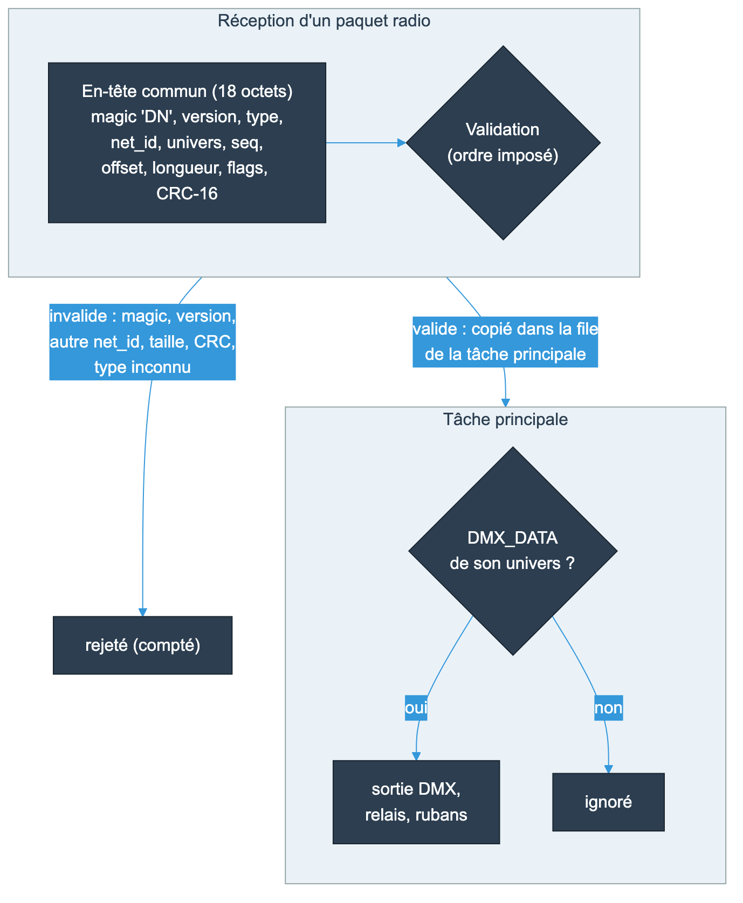

**Canal** : un canal Wi-Fi fixe (1, 6 ou 11 recommandés), commun au dongle et aux
nœuds. **Occupation** : environ 4 % du canal par univers à 6 Mbit/s ; limite
recommandée **4 univers par dongle**.

**Auto-réparation** : un nœud qui n'entend plus son réseau pendant **60 s** balaie les
canaux 1 à 13 (300 ms par canal) jusqu'à retrouver son `net_id`, puis adopte ce canal.
Pendant ce temps, il continue d'émettre la dernière trame DMX.

## 4. Le nœud

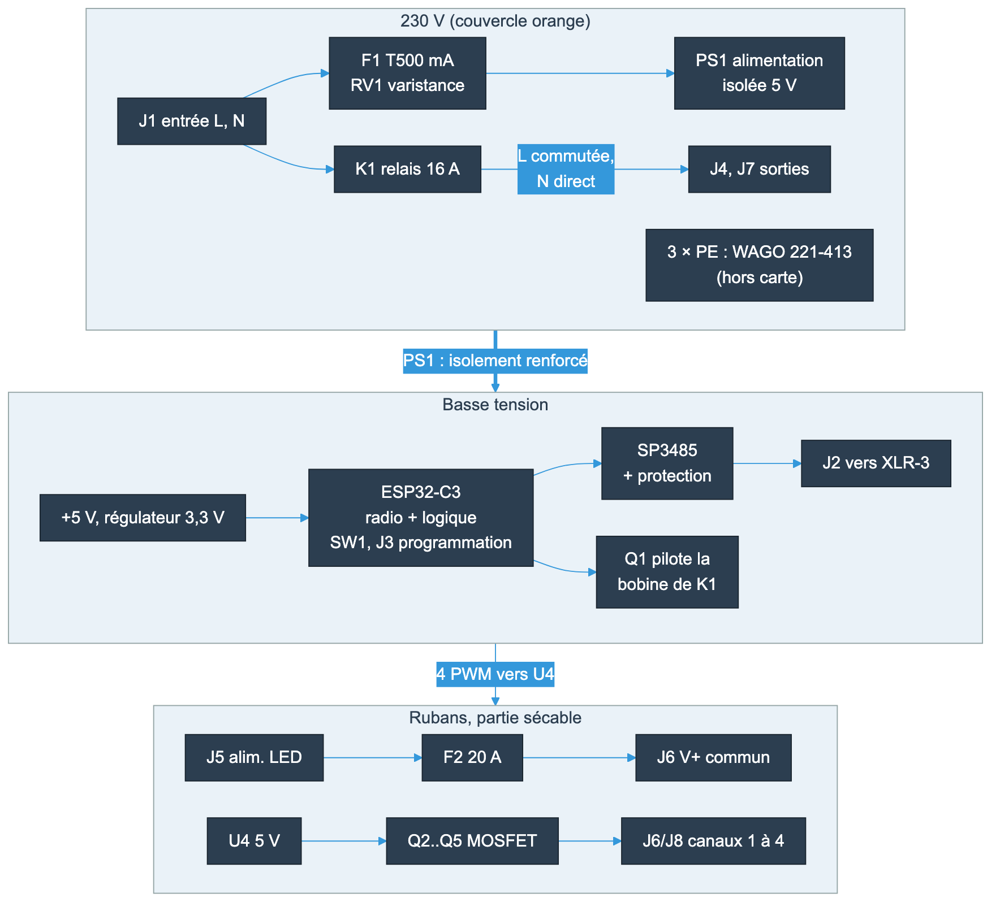

- **Une carte, deux variantes** : la carte est livrée entière ; on scie la partie rubans
  si on n'en a pas besoin. Le firmware reconnaît la variante au démarrage (BOARD_SENSE).
- **Isolement** : tout le 230 V est à gauche de la barrière (fentes fraisées, ≥ 6 mm de
  cuivre à cuivre, cloison du boîtier) ; seul PS1 la franchit, par son isolement
  interne certifié. 🔴 [securite.md](securite.md)
- **Rien de métallique près de l'antenne** (hachures) : pas de vis ni d'insert à moins
  de 15 mm.

### Cycle de vie du nœud

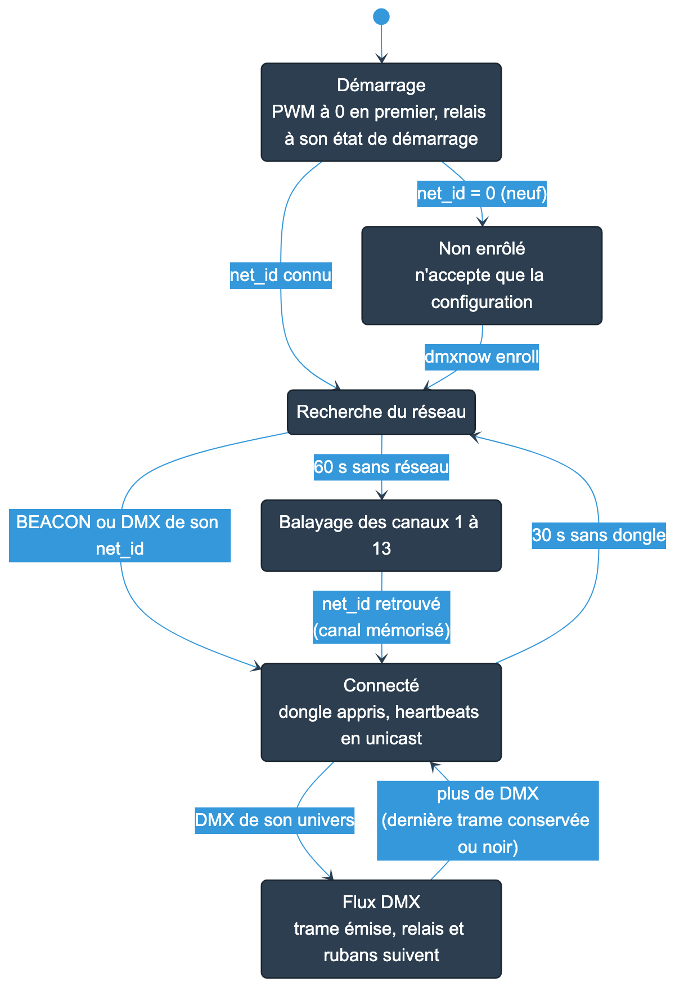

En parallèle de ces états : **maintenance** (point d'accès + page web, §8) et
**identification** (clignotement), qui n'interrompent pas la sortie DMX.

## 5. Le relais

Le relais coupe la **phase** des deux sorties 230 V (projecteur, alimentation des
rubans). Qui décide ?

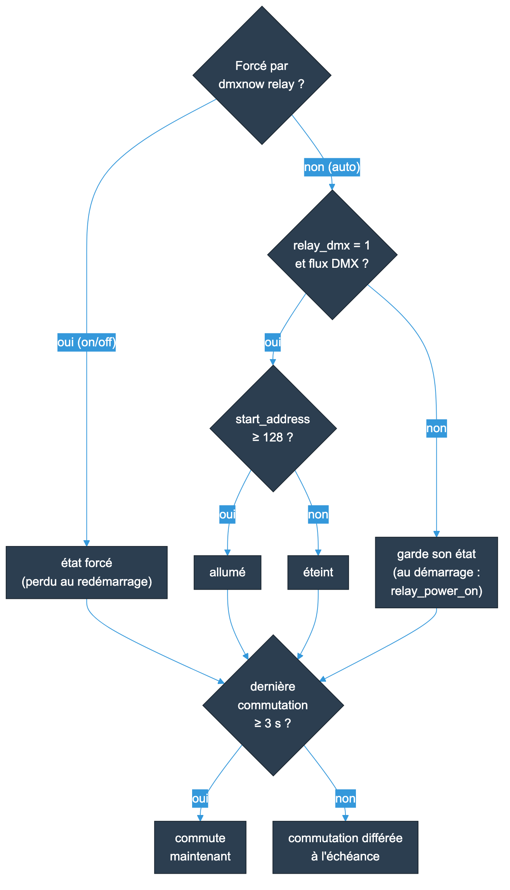

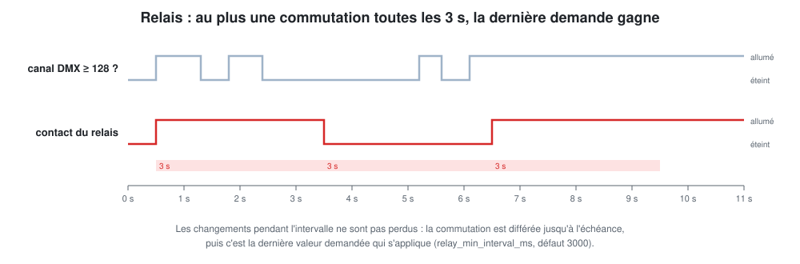

- Le canal agit sur un **niveau** (≥ 128 allumé), pas sur un front.
- **Perte du flux** : le relais ne bouge pas (un projecteur ne s'éteint pas parce que le
  Pi redémarre).
- L'état est mémorisé à chaque commutation effective, ainsi qu'un compteur de
  commutations visible dans `dmxnow nodes`.

## 6. Les rubans LED

Quatre sorties à MOSFET côté masse, pour rubans à **anode commune** 12 ou 24 V (RGB,
RGBW ou quatre rubans blancs). 6 A par canal, 16 A au total.

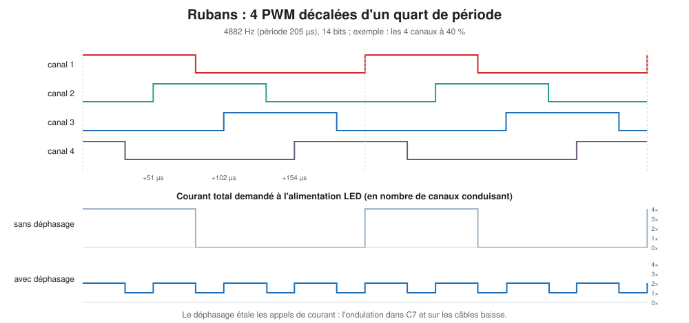

| Fonction | Principe | Réglage |
|----------|----------|---------|
| **PWM 4882 Hz, 14 bits** | Au-dessus du seuil de scintillement visible et des caméras courantes ; 16 384 niveaux | `pwm_freq_hz` (≤ 19,5 kHz, résolution déduite) |
| **Déphasage** | Les 4 canaux commencent chacun un quart de période plus tard : les appels de courant s'étalent | automatique |
| **Gamma** | Corrige la perception de l'œil : les faibles valeurs DMX restent fines | `gamma_x10` (10 = linéaire, 22 défaut) |
| **8 ou 16 bits** | 16 bits = 2 canaux DMX par couleur, fondus très lents sans paliers | `pwm_mode` |
| **Fondu à l'allumage** | Rampe à la mise sous tension et à chaque rallumage du relais | `fade_on_ms` (500) |
| **Démarrage propre** | Les PWM sont mises à 0 avant toute autre chose : pas de flash au démarrage | automatique |

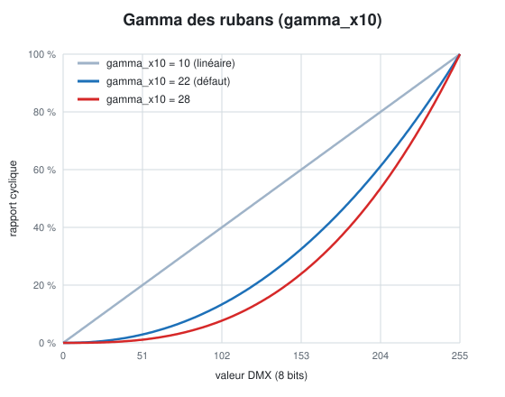

## 7. Commandes, enrôlement, sécurité

Les commandes ne sont pas répétées en continu comme le DMX. Elles sont donc
**acquittées et retransmises** :

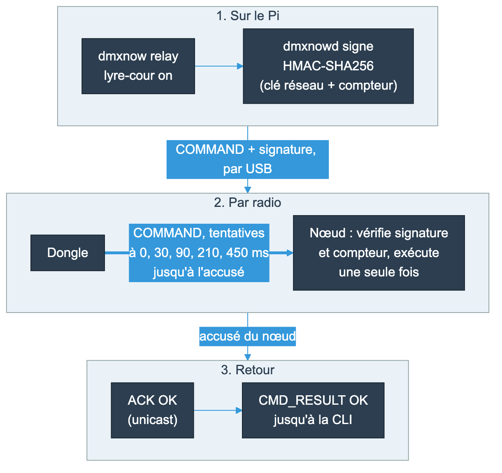

- Ciblée : **5 tentatives** (30, 60, 120, 240 ms), moins de 0,5 s en tout.
- `all` : 3 émissions à 20 ms d'intervalle, puis 1 s de collecte des accusés.
- Un doublon n'est jamais exécuté deux fois (le nœud mémorise les 16 dernières commandes).

### Enrôlement

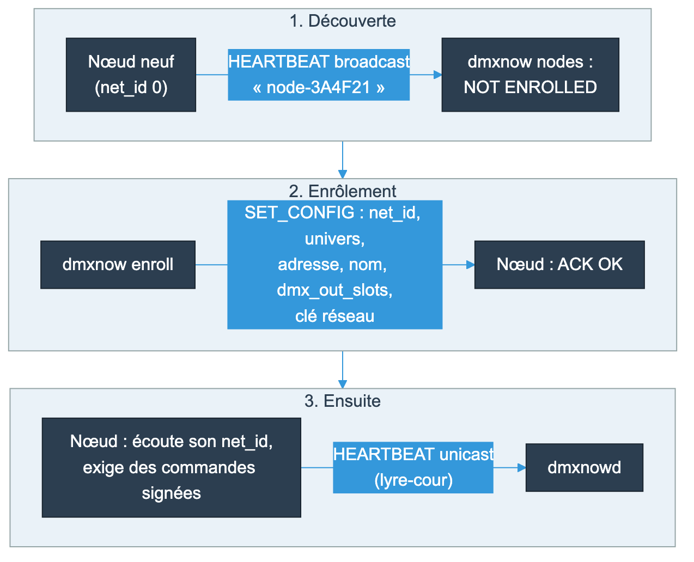

**Ce qui est protégé** : une commande (relais, maintenance, remise à zéro, réglage)
n'est acceptée que signée par le Pi qui détient la clé ; une commande rejouée est
refusée. `IDENTIFY`, inoffensive, reste libre. Le flux DMX n'est pas signé : la menace
visée est l'erreur (deux installations voisines), pas le sabotage d'un spectacle.

## 8. Maintenance et mise à jour

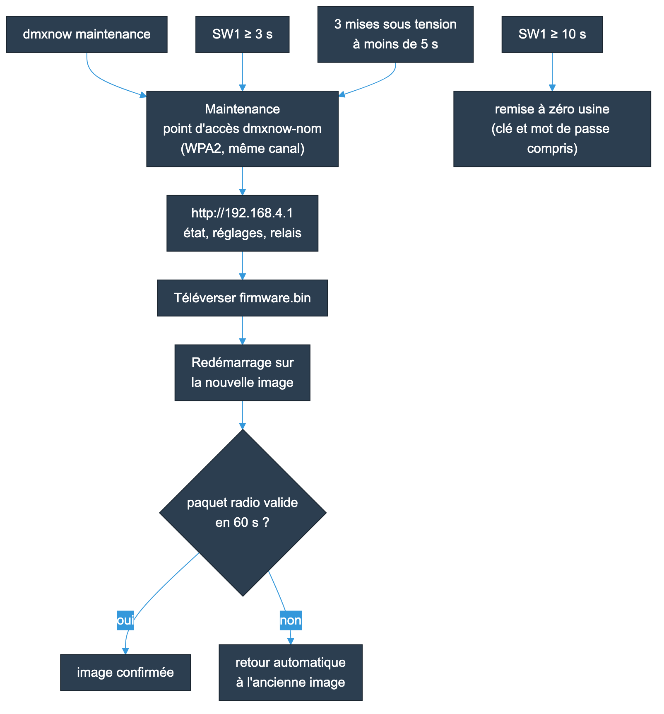

La réception ESP-NOW continue pendant la maintenance : le projecteur reste piloté.

## 9. Le dongle et le Raspberry Pi

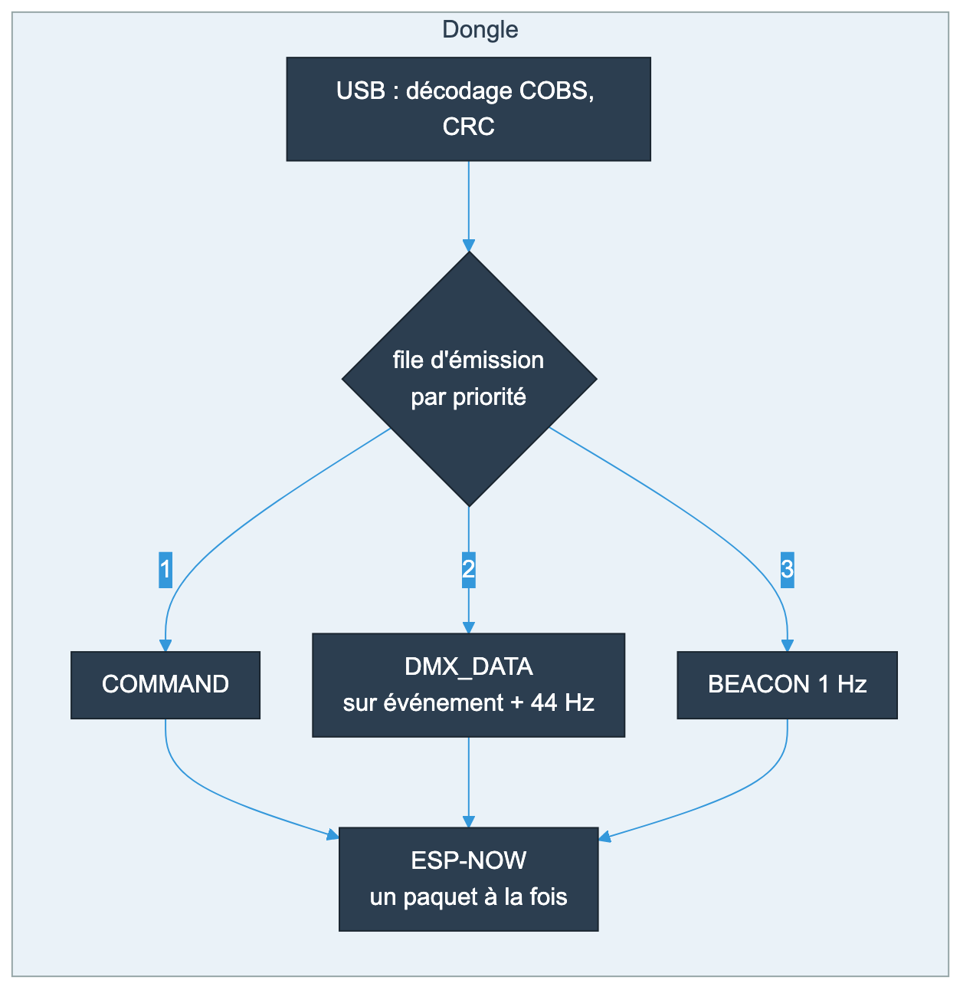

| Comportement | Valeur |
|--------------|--------|
| Pi silencieux (démon arrêté, USB coupé) | le dongle maintient les univers **10 s** (`hold_timeout_ms`), puis seulement la balise |
| Liaison USB surveillée | `PING` chaque seconde ; réouverture du port après 3 s sans réponse |
| Démon planté | redémarré par systemd en 1 s |
| Dongle identifié | `/dev/dmx-dongle` par son numéro de série (plusieurs ESP32 sur le même Pi possibles) |
| Découverte Art-Net | réponse aux ArtPoll : QLC+ voit dmxnow comme un nœud Art-Net |

## 10. Options

### Matériel

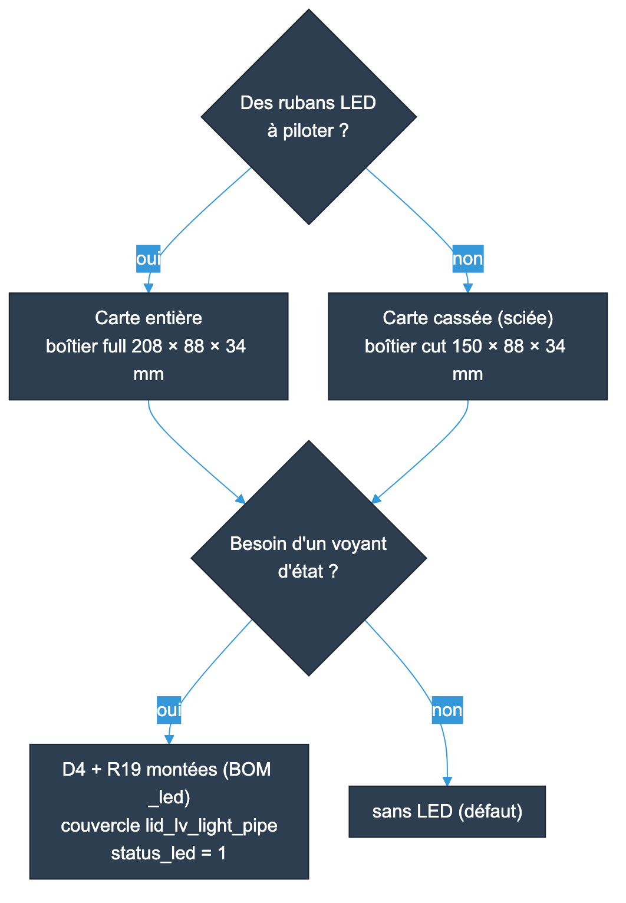

| Carte entière (`full`) | Carte cassée (`cut`) |
|:---:|:---:|
| 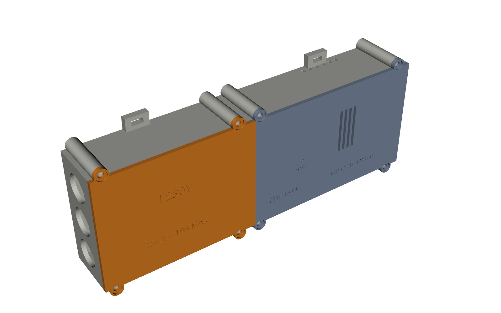 | 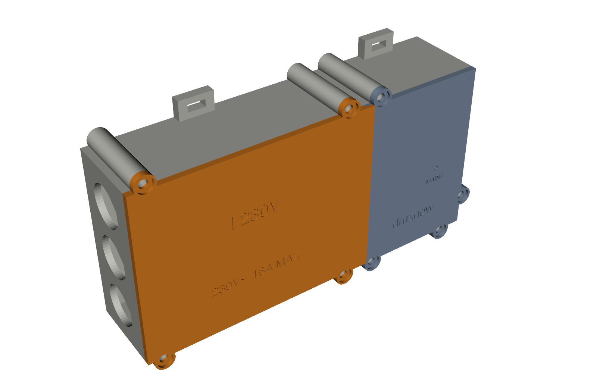 |
| 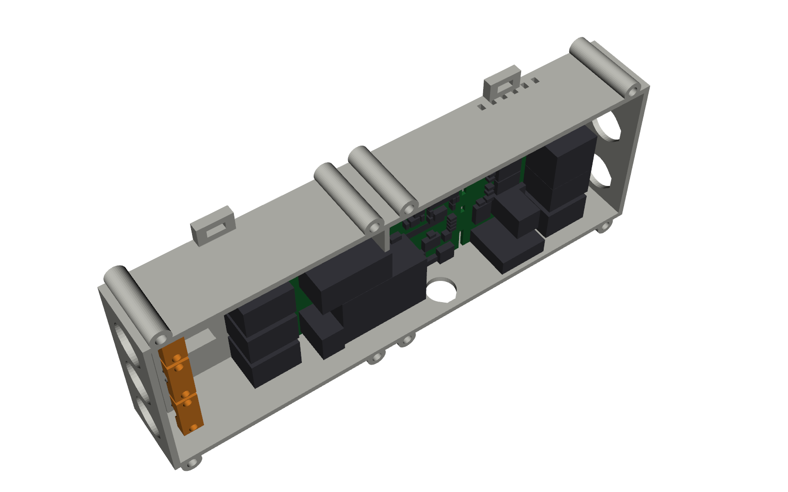 | 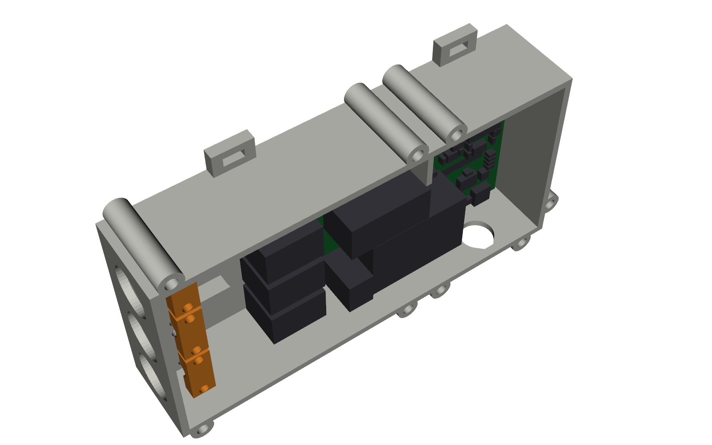 |

| Dongle |
|:---:|
| 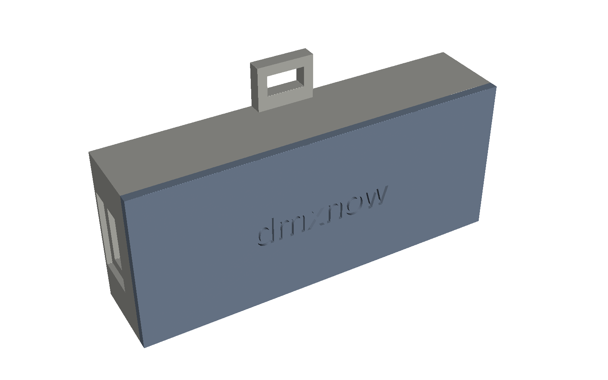 |

### Réglages du nœud

| Famille | Clé | Défaut | Choix |
|---------|-----|--------|-------|
| Adressage | `universe`, `start_address` | 0, 1 | univers et premier canal du nœud (relais puis rubans) |
| | `dmx_out_slots` | 512 | longueur de la trame DMX : 512 = compatible, courte = rapide |
| | `identify_slot` | 0 | canal forcé à 255/0 pendant l'identification (0 = aucun) |
| Relais | `relay_dmx` | 1 | suit le canal DMX, ou commande seule |
| | `relay_power_on` | 2 | au démarrage : éteint, allumé, dernier état |
| | `relay_min_interval_ms` | 3000 | intervalle minimal entre commutations |
| Perte de flux | `loss_blackout_ms` | 0 | 0 = garder la dernière trame ; sinon noir après ce délai |
| Rubans | `pwm_mode`, `gamma_x10`, `fade_on_ms`, `pwm_freq_hz` | 0, 22, 500, 4882 | §6 |
| Radio | `radio_channel`, `net_id` | 6, 0 | canal et réseau |
| Maintenance | `maint_password` | aléatoire | mot de passe du point d'accès (écriture seule) |
| | `powercycle_maint` | 1 | trois mises sous tension ouvrent la maintenance |
| Voyant | `status_led` | 0 | 1 si D4 est montée |

### Réglages du dongle et du démon (`/etc/dmxnow/dmxnowd.toml`)

| Clé | Défaut | Choix |
|-----|--------|-------|
| `universes` | `[0]` | univers Art-Net transmis (4 au plus conseillé) |
| `channel` | 6 | canal radio |
| `phy_rate` | `6M` | débit radio : 6M (défaut), 12M, 24M, ou 1M à 11M (plus de portée, plus d'occupation) |
| `power_dbm` | 15 | puissance ; 15 dBm + antenne 5 dBi ≈ 20 dBm PIRE, limite européenne |
| `mode` | `v2` | `v2` = un paquet par univers ; `v1` = fragmenté (compatibilité) |
| `refresh_hz`, `hold_timeout_ms` | 44, 10000 | rafraîchissement et maintien sans Pi |
| clé réseau | générée | `install.sh --no-key` : commandes non signées (déconseillé) |

### Voyant d'état (option D4)

| Voyant | Signification |
|:------:|---------------|
| ● fixe | flux DMX reçu |
| ◐ 1 Hz | réseau entendu, pas de DMX |
| ●● double éclat | aucun dongle |
| ✱ 5 Hz | maintenance |
